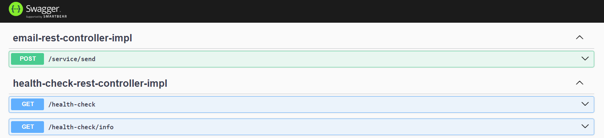

<h1 id="top" align="center">🚢 Release Version 1.0.0</h1> 

<br/>

## 🔍 Table of Contents

- [Features](#features)
- [Limitations](#limitations)
- [System Startup](#system-startup)
  - [Developer Mode](#developer-mode)
  - [Production Mode](#production-mode)
- [Endpoint Documentation](#endpoint-documentation)
- [Manuel Testing](#manuel-testing)
 
<br/>

<h2 id="features">🔥 Features</h2>

+ Manual Postman endpoint tests implemented.
+ Swagger documentation has been integrated.
+ Environment variables have been adjusted.
+ The application has been Dockerized.

<br/>

<h2 id="limitations">🚧 Limitations</h2>

- Lack of TLS/HTTPS support.
- Lack of internal communication with frontend.

<br/>
  
<h2 id="system-startup">🚀 System Startup</h2> 

<h3 id="developer-mode">🧪 Developer Mode</h3>

#### Using command line

```
mvnw spring-boot:run
```

#### Using Docker

```
docker build -t micro-email-image .

docker run -d -p 8080:80 --name micro-email-container micro-email-image

docker ps -a

docker rm -f micro-email-container
```

<br/>

<h3 id="production-mode">⚡Production Mode</h3> 

1. Copy `application-dev.properties` to create `application-prod.properties`.
2. Place credentails in a `application-prod.properties`.
3. Follow the instructions in the [`Micro-Docker-Config repository`](https://github.com/ahmettoguz/Micro-Docker-Config) to configure Docker for production.

<br/>

<h2 id="endpoint-documentation">📍 Endpoint Documentation</h2>



<br/>

<h2 id="manuel-testing">🔬 Manual Testing</h2>

To ensure high-quality assurance through manual testing, investigate the [`Postman Collection`](src/main/resources/assets/postman-collection/micro-email-service.postman_collection.json).


[🔝](#top)

